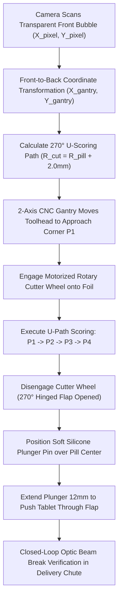

# Deep Dive Technical Documentation: Strip Scoring & Tablet Ejection Mechanism

## 1. Overview & Mechanical Philosophy

In conventional automated pill dispensers, medication extraction relies on high-force mechanical punching through uncut blister packs. This brute-force approach frequently causes fragile tablets (e.g., uncoated aspirin, sublingual wafers, or softgel capsules) to fracture, crumble, or burst.

**Blister Bot** solves this through a non-destructive two-stage mechanism:
1. **270-Degree U-Shaped Foil Scoring**: A motorized rotary cutter wheel scores a 270° U-shaped arc through the opaque aluminum foil backing, creating a hinged flap while leaving the top edge connected.
2. **Soft Silicone Plunger Ejection**: A spring-loaded silicone plunger pin gently pushes against the transparent front PVC bubble, guiding the tablet out through the pre-scored foil flap without touching or scratching the medication.

---

## 2. Step-by-Step Kinematic Sequence



---

## 3. Mathematical Coordinate & Clearance Equations

### Front-to-Back Coordinate Transformation
The front camera observes transparent PVC bubbles in image pixel space. The transformation to rear aluminum gantry millimeter coordinates is given by:

\[X_{\text{gantry}} = (X_{\text{pixel}} \times S_x) + O_x\]
\[Y_{\text{gantry}} = (Y_{\text{pixel}} \times S_y) + O_y\]

Where:
- \(S_x, S_y\): Scale calibration factors (\(\approx 0.45\text{ mm/pixel}\))
- \(O_x, O_y\): Physical offset between camera optical center and gantry home origin

### Dynamic Safety Clearance Margin
To guarantee the rotary cutter blade never comes into physical contact with the medication:

\[R_{\text{cut}} = R_{\text{pill}} + \Delta_{\text{safety}}\]

Where \(\Delta_{\text{safety}} = 2.0\text{ mm}\).

### 270-Degree U-Flap Trajectory Waypoints
For a target pill centered at \((X_c, Y_c)\), the cutter traverses the following four waypoints:
1. **P1 (Top-Left Approach)**: \((X_c - R_{\text{cut}}, Y_c + R_{\text{cut}})\)
2. **P2 (Bottom-Left Corner)**: \((X_c - R_{\text{cut}}, Y_c - R_{\text{cut}})\)
3. **P3 (Bottom-Right Corner)**: \((X_c + R_{\text{cut}}, Y_c - R_{\text{cut}})\)
4. **P4 (Top-Right Corner)**: \((X_c + R_{\text{cut}}, Y_c + R_{\text{cut}})\)

*The top horizontal segment between P4 and P1 remains un-cut (90° open angle), forming the flexible aluminum hinge.*

---

## 4. Hardware & Software Component Integration

| Component | Role in Scoring & Ejection | Implementation |
| :--- | :--- | :--- |
| **Rotary Cutter Wheel** | 270-degree foil scoring | Motorized dark steel cutting disc driven by gantry toolhead |
| **Silicone Plunger Pin** | Gentle tablet ejection | Soft orange silicone pin actuated by 12mm stroke solenoid |
| **2-Axis CNC Gantry** | X/Y motion positioning | NEMA 17 steppers driven by STM32 MCU (`AccelStepper.h`) |
| **Vision Mapper** | Target coordinate calculation | Python module (`deblister_vision_mapper.py`) |
| **Firmware Controller** | Real-time motion execution | Arduino C++ sketch (`scoring_gantry_controller.ino`) |
| **3D Kinematic Model** | Visual simulation & validation | Blender 5.2 model (`scoring_mechanism.blend`) |
| **Video Demonstration** | Animated sequence breakdown | MP4 video render (`scoring_mechanism_demo.mp4`) |

---

## 5. File & Asset Directory (`scoring mechanism/`)

```
c:/FARIS/Blister Bot/Blister-bot-main-/Week 1/scoring mechanism/
├── deblister_vision_mapper.py       # Python coordinate transformer & U-trajectory mapper
├── scoring_gantry_controller.ino    # STM32 C++ firmware sketch for CNC gantry & plunger
├── animate_scoring_mechanism.py     # Blender 5.2 Python script generating 3D model & video
├── scoring_mechanism.blend          # Specialized Blender 3D model file
├── scoring_mechanism_demo.mp4       # Rendered MP4 animation video sequence
├── Scoring_Mechanism_DeepDive.md    # Technical deep-dive documentation (this file)
├── Scoring_Mechanism_Report.pdf     # Publication-ready PDF document report
├── scoring_toolhead.png             # Frame 25: Toolhead approach render
├── u_flap_scored.png                # Frame 80: 270° U-flap scored render
└── tablet_ejection.png              # Frame 105: Soft plunger tablet ejection render
```
